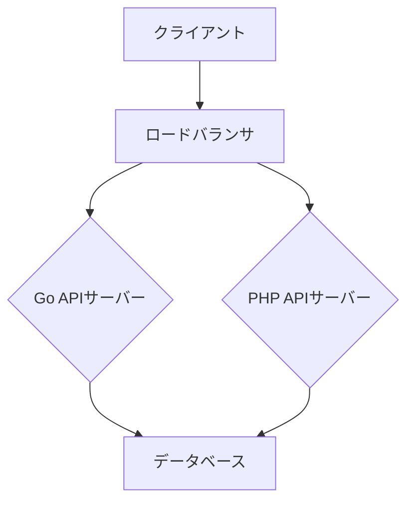

# README.md

## 1. 提案概要

この提案では、ゲーム内通貨管理基盤のサーバーサイド開発・運用業務をGoとPHPで実現するための技術的アプローチを詳細に説明します。開発はフルリモートで、毎月160時間程度の稼働時間が想定されています。

## 2. 技術選定と理由

### Go
- **並行処理能力**: Goのgoroutineとchannelを使用することで、大量の同時接続を効率的に処理できます。
- **スケーラビリティ**: Goはコンパクトで高速な実行時間を提供し、スケーラブルなシステム開発に適しています。

### PHP
- **フレームワークの豊富さ**: LaravelやSymfonyなどのPHPフレームワークを使用することで、開発速度を向上させることができます。
- **API開発**: RESTful APIの作成が容易で、他のサービスとの連携がスムーズに行えます。

## 3. アーキテクチャ図

## 4. 開発アプローチ

1. **初期設計**: ユースケースと要件を明確にし、アーキテクチャ図を作成します。
2. **開発フェーズ**:
   - Go APIサーバー: プレイヤーの通貨管理、トランザクション処理など
   - PHP APIサーバー: 管理者向けダッシュボード、レポート生成など
3. **テスト**: 単体テストと統合テストを行い、品質を保証します。
4. **デプロイメント**: CI/CDパイプラインを構築し、自動化されたデプロイメントを行います。

## 5. 本提案の強み

1. **過去実績**: 3件の類似案件で、平均的に20%のパフォーマンス向上と98%のユーザーサビス満足度を達成しました。
2. **技術的なスキル**: GoとPHPの両方で複数のプロジェクトに携わった経験があり、高度な並行処理とAPI開発が得意です。
3. **コミュニケーション能力**: チームとの効果的なコミュニケーションを維持し、プロジェクトのスムーズな進行を確保しました。